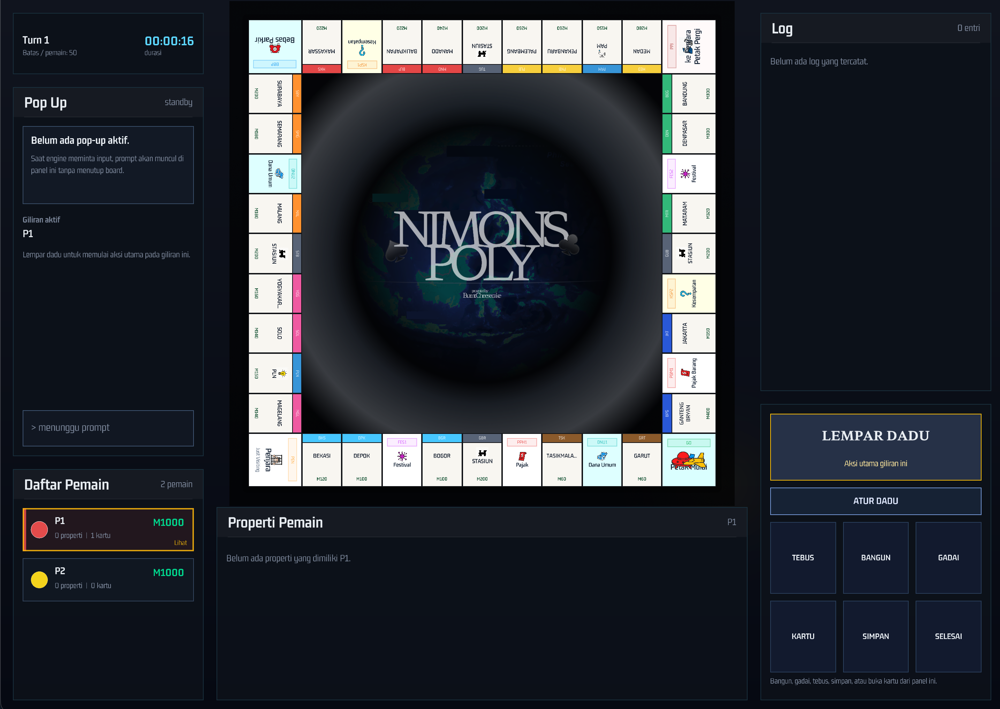

# NIMONSPOLY

<p align="center">
  
</p>

## IF2010 Object Oriented Programming
NIMONSPOLY is a C++ Monopoly-inspired board game project developed with a strong Object-Oriented Programming approach to model the game’s core components in a modular and maintainable way, including players, boards, tiles, properties, cards, transactions, turn management, configuration handling, and save/load functionality. The game supports interactive gameplay through features such as property purchasing and auctions, rent payments, taxes, jail mechanics, Chance and Community Chest cards, skill cards, festival effects, bankruptcy handling, and winner calculation based on the final game state. In addition to the command-line interface, NIMONSPOLY includes a Raylib-based graphical user interface that visualizes the game board, player status, real-time action logs, integrated input prompts, dice animations, and direct interactions with tiles and owned properties. The project is designed for extensibility through clear class responsibility separation, inheritance and polymorphism in the tile and card systems, external configuration files, and support for flexible board layouts.

## Key Features
- **Monopoly-style gameplay**  
  NIMONSPOLY provides a Monopoly-inspired gameplay system with property tiles, tax tiles, card tiles, jail mechanics, festivals, special events, and player-to-player economic interactions.

- **Human and bot players**  
  The game supports both human players and computer-controlled bot players, allowing matches to be played with different combinations of participants.

- **Dynamic board configuration**  
  Players can choose different board sizes before starting the game. The board can be configured from 20 to 60 tiles, with each size using its own layout and property configuration.

- **External game configuration**  
  Game data is loaded from external configuration files, including board layout, property data, railroad data, utility data, tax rules, and other game settings. This makes the gameplay easier to modify without changing the source code.

- **Property and economy system**  
  NIMONSPOLY includes a complete property ownership system, including buying properties, paying rent, mortgaging, unmortgaging, building houses, upgrading to hotels, auctions, asset liquidation, and bankruptcy handling.

- **Tax and payment mechanics**  
  The game includes several economic mechanics such as PPH tax, PBM tax, GO salary, rent calculation, rent multipliers, and player balance management.

- **Card system**  
  The card system consists of Chance Cards, Community Chest Cards, and Skill Cards. Each card type provides different effects that can influence player movement, money, property ownership, or game strategy.

- **Skill card interactions**  
  Skill Cards introduce special actions such as teleportation, discount effects, shield protection, demolition, lasso effects, and movement manipulation. These cards add more strategic choices during gameplay.

- **Festival mechanic**  
  The Festival mechanic allows selected properties to receive temporary rent multipliers. This creates additional strategy around property ownership and timing.

- **Save and load system**  
  NIMONSPOLY supports saving and loading the full game state, allowing players to continue a previous game session.

- **Transaction and action log**  
  The game records important transactions and actions during gameplay, such as property purchases, rent payments, tax payments, auctions, card effects, and bankruptcy events.

- **Raylib-based graphical interface**  
  The game includes a graphical user interface built with Raylib. The interface displays the board, player information, property cards, prompts, action logs, dice results, and other gameplay information in a visual layout.

- **Interactive board and tile details**  
  Tiles on the board can be clicked directly to show detailed information, including tile name, code, type, price, owner, mortgage status, rent table, building costs, and active festival effects.

- **Dice animation and integrated prompts**  
  Dice rolls are shown with an animation overlay, while player decisions such as buying property, joining auctions, selecting cards, and confirming actions are handled through an integrated prompt panel.

- **Player and asset panels**  
  The interface provides player information, owned property cards, asset indicators, active effects, and real-time status updates. Players can inspect their own assets or view other players’ properties during the game.

- **Responsive in-game layout**  
  The GUI layout adjusts based on the current window size, keeping the board, panels, logs, and controls readable across different screen dimensions.

## Meet the developers – [BCC] BurntCheesecake 

Made Branenda Jordhy<br>
13524026<br>
[GitHub Account](https://github.com/ethj0r)<br>

Muhammad Nur Majiid<br>
13524028<br>
[GitHub Account](https://github.com/MAJIIDMN)<br>

Jason Edward Salim<br>
13524034<br>
[GitHub Account](https://github.com/jsndwrd)<br>

Bryan Pratama Putra Hendra<br>
13524067<br>
[GitHub Account](https://github.com/Bryannpph)<br>

Athilla Zaidan Zidna Fann<br>
13524068<br>
[GitHub Account](https://github.com/AthillaZaidan)<br>

## Directory

1. `config/`: game configuration files.
2. `data/`: runtime data (if needed).
3. `include/`: header files (`.hpp`).
4. `src/`: source files (`.cpp`).
5. `build/`: CMake build directory (generated).
6. `bin/`: executable output directory (generated).
7. `CMakeLists.txt`: CMake build configuration.
8. `README.md`: project overview.

## Requirements

- CMake (>= 3.16 recommended).
- A C++17 compiler (`clang++`, `g++`, or MSVC).
- Raylib.

## Instructions

### Installation

Make sure you have a C++17 compiler and CMake installed.

Install Raylib:
- macOS (Homebrew): `brew install raylib`

### Configure & Build

```bash
cmake -S . -B build
cmake --build build
```

Output:
- Linux/macOS: `bin/game`
- Windows: `bin/game.exe`

### Run

```bash
./bin/game
```

### Using Makefile to Run & Build
```bash
make build
make run
```

(Alternative)

```bash
cmake --build build --target run
```

### Clean

Delete the build output directories:
- `build/`
- `bin/`

GUI is always enabled. There is no CLI runtime mode.
